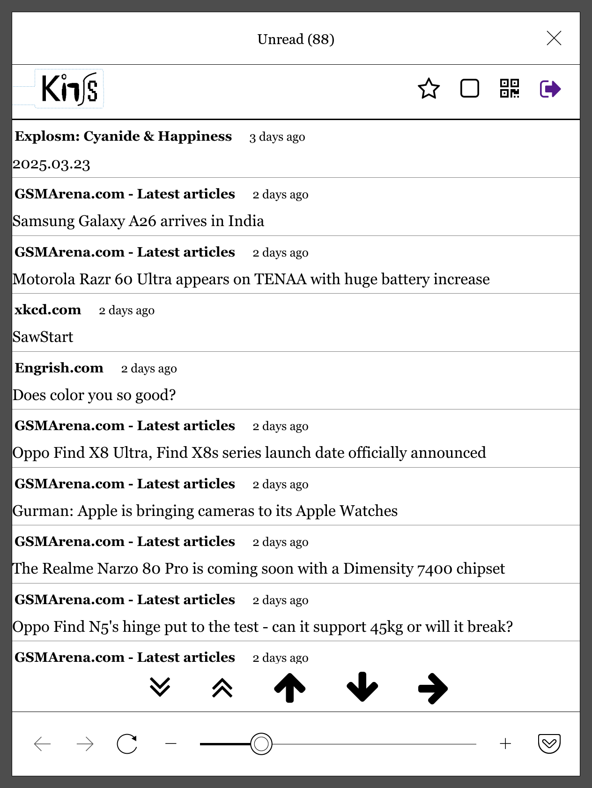
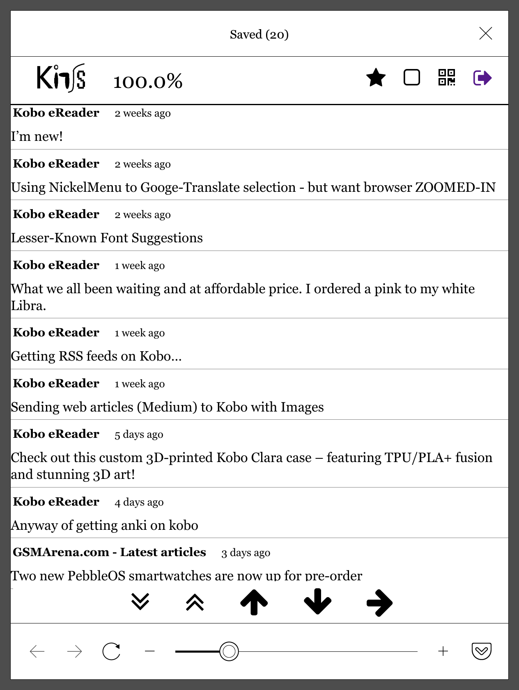
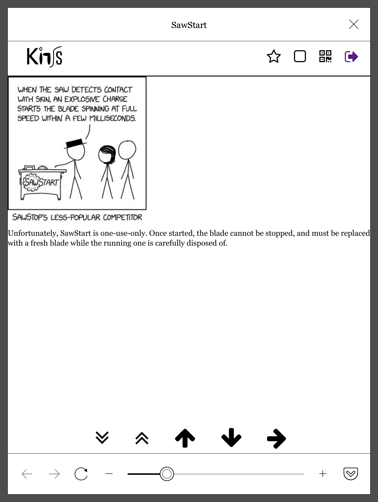
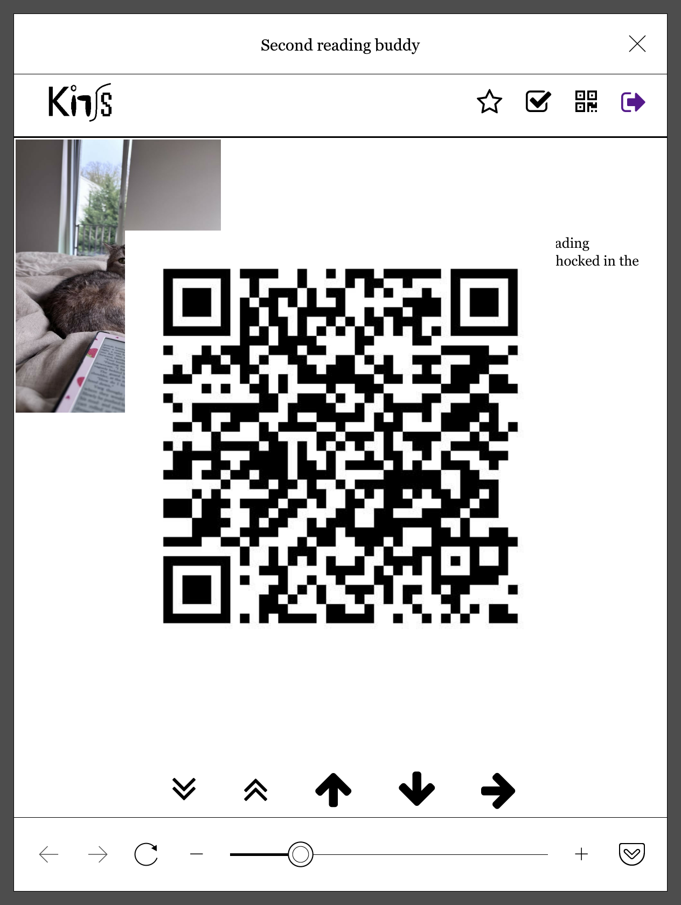

## About Kinss
[Kinss](https://github.com/xizeyoupan/kinss) is a lightweight feed reader for e-ink readers such as Kindles, using Fever API to connect to compatible aggregators (e.g. FreshRSS, Miniflux, etc).

This is a fork that adapts it to the ~~inferior~~ experimental browser on Kobo eReaders (Tested on a Kobo Libra 2, should work on most Kobo eReaders with the experimental browser).

## Changes

- UI is made larger (due to changing `font-size` in the CSS) to compensate for the abysmal default zoom of the Kobo browser (the default zoom cannot be changed).

- Some more images can load when previously wouldn't.

## Quickstart
1. `pip install -r requirements.txt`
2. Run `app.py`. The default IP is at `0.0.0.0`. Default port is `5000`.

## Docker
### Installation
1. Download image:

`$ docker pull duckennguyen/kinss`

2. Run with Docker:

`$ docker run --restart always -d --name kinss -p 5000:5000 duckennguyen/kinss`

The app should be running at http://0.0.0.0:5000/.

## Usage
Login credentials format is as follows:
- **Username**: `Your Fever username`
- **Password**: `Your Fever password`
- **API Endpoint**: `URL of the Fever API providing aggregator. For example: https://example.com/fever/`

## Aggregator
Kinss works exclusively through Fever API, so any aggregator that can be configured to provide a Fever API endpoint should work, such as FreshRSS, Miniflux, etc...

## Direct link login
You can login directly using a link with the following format: `https://example.com/login?name=<Fever Username>&psd=<Fever Password>&endpoint=<Fever API Endpoint URL>`. This is especially convenient for eReader browsers, which usually have cumbersome text input processes.

On Kobo, you can favorite the direct login link for convenient access, or set it as the homepage. You can also set up a [NickelMenu](https://pgaskin.net/NickelMenu/) entry to launch the browser with the direct login link. For example:

`menu_item : main : RSS Reader : nickel_browser : modal : https://example.com/login?name=<Fever Username>&psd=<Fever Password>&endpoint=<Fever API Endpoint URL>`

**Note: The direct login link exposes your password in plaintext.**

## Features
- Mark as read/unread
- Save (star) entries
- QR code of original article

## Screenshots (Kobo Libra 2)

## License
Kinss is open-source under the [MIT license](https://opensource.org/licenses/MIT).
